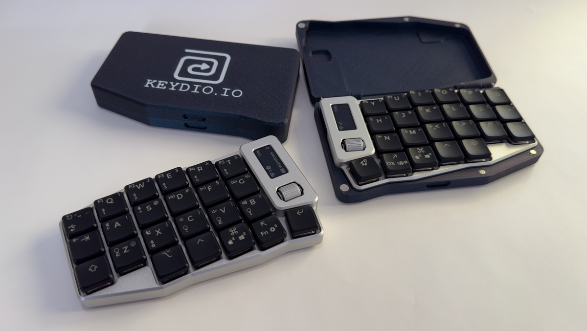

# Introduction
The Rolio 46 is now at the version 1.0 release! This repo contains all the design files so you can build your own Rolio 46.1.

I will be [opening a store](https://keydio.io) to make it easier for people to make their own Rolio 46.1, all of the required parts and sub assemblies will be available for purchase. The main PCBs (AKA receiver boards) will be sold with all of the surface mount components pre-soldered.

Tutorial videos on how to do the through hole soldering and final assembly should be available in January 2024 as part of the store launch.

I will keep all of the design files freely available, the Rolio 46 relies heavily on open source products like [ZMK](https://zmk.dev) and I'd like to give something back to the community.

# Features
The keyboard itself:
- Fully wireless thanks to the awesome [ZMK firmware](https://zmk.dev)
- Excellent battery life, I've personally been getting 2+ weeks before it gets to 60%
- A low profile, compact choc spaced form factor that is similar to the Corne
- Additional "Sometimes" buttons on the bottom row just like the Sofle
- Horizontal roller encoders on both halves
- A backlight that is efficient enough to be used on battery
- A robust chassis so that it can be treated like a normal keyboard
  - An FDM version for at home low cost production
  - An SLS chassis for a more refined look at a lower cost than CNC based options
  - A CNC option for a slick look and very premium feel
- A travel case that can easily be made using any FDM printer

ZMK Keymap & Custom keycaps:
- Up to five memorized bluetooth profiles and a USB mode
- The keycaps are fully customized and match the ZMK keymap thanks to [FKCaps](https://fkcaps.com/custom/FGE2DW)
- MacOS and Windows modes as part of the keymap to keep the "same" handy macros in both OSs
- All of the symbols and special behaviors can be accessed using at most two keys
- The settings keys and different modes are documented in the key caps themselves (easy to learn).
- The keymap can be easily customized thanks to ZMK, the keycaps can also be customized to suit your needs
   - Here is a starting point for making your own key caps: [FKCaps](https://fkcaps.com/custom/FGE2DW)

# Build Resources
In order to build a Rolio 46.1 you will need 5 main sub assemblies, the links below provide information about the different sub assemblies:
 * [The controller](doc/controller.md)
 * [The display](doc/display.md)
 * [The battery](doc/battery.md)
 * [The receiver](pcb/README.md)
 * [The chassis](chassis/README.md)

The receiver and chassis are the sub assemblies that are most unique to this project, all of the other sub assemblies are fungible.

# Firmware

You can download the latest firmware from here: [releases](https://github.com/MickiusMousius/RolioKeyboard/releases)

If you want to customise the firmware (or your keymap) fork the following repository: [RolioFirmware](https://github.com/MickiusMousius/RolioFirmware)

When you push a change to your fork a GitHub action will create a new firmware build for you.

# Other Components

<ins>Keycaps</ins>

This keyboard has been designed to use MBK caps. You should however be able to use any Choc compatible (including choc spacing) compatible caps.

You can order a set of custom keycaps from a number of possible suppliers too.

I have a design at FKCaps that has the keymap of this board integrated into the keys. The link for this key cap set can be found [HERE](https://fkcaps.com/custom/FGE2DW).

<ins>Switches</ins>

The Rolio 46 is designed for use with Choc V1 switches, these can be purchased from many different vendors. My personal favorite switch is the "Choc Sunset" switch.

# To Do
 * Publish the travel case models
 * Publish the tenting kit models
 * Make some small improvements to the base plates and dampers to improve the sound profile
 * Launch a store...

# Gallery

