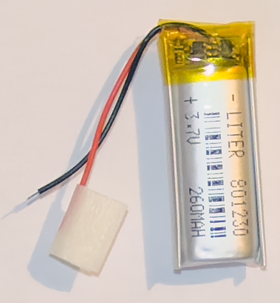

# Introduction

The Rolio 46.1 is designed to use a small rechargeable lithium battery with charging provided by the [controller](controller.md).

# The Batteries

Only protected cells should be used with the Rolio 46.1. Additionally, you should only purchase batteries that are reasonably known to be of good quality.

The [receiver boards](../pcb/README.md) have been designed to accommodate a protected 801230 battery below the controller, however, a 701230 battery would likely also fit quite well, though may require securing with Kapton tape.

I have tested the Liter Energy 801230 batteries, their capacity consistently tests a little over 250mAh. The battery type that has been tested is photographed below:

|||

I have found that these batteries can provide more than a month of normal usage with a Nice!Nano controller.

I have ordered my batteries from [Bihuade](https://www.aliexpress.com/item/1005005386757680.html?spm=a2g0o.productlist.main.1.263e3038UOZ4Qv&algo_pvid=bce701a3-8594-4ecc-942a-21ea5054fd70&algo_exp_id=bce701a3-8594-4ecc-942a-21ea5054fd70-0&pdp_npi=4%40dis%21AUD%2136.48%2122.25%21%21%2123.56%21%21%402101c5a417006478945408733eee70%2112000032843802900%21sea%21AU%21192529469%21&curPageLogUid=edHWUMlJBN5P) ([Alternative](https://bihuade.com/products/37v-260mah-801230-liter-energy-battery-rechargeable-polymer-lithium-ion-battery-for-drone-dvr-power-bank-speaker)).