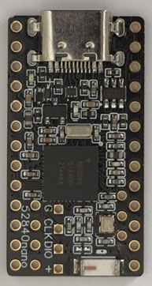

# Introduction

The controller provides the "brains" for the Rolio46 keyboard. All of the tested controllers provide the Bluetooth connectivity as well as battery charging and USB functionality. 

Te following page as some excellent information regarding various controller options: https://github.com/joric/nrfmicro/wiki/Alternatives

# Controllers

There are three different controllers that have been tested with this project.

| Nice!Nano  | SuperMini 52840 | 52840Nano |
| ------------- | ------------- | ------------- |
|   |   |   |

Details for each controller are summarized below.

### Nice!Nano V2

This is the most common of the available controllers and arguably the best. Documentation for this controller can be found on [nice keyboards](https://nicekeyboards.com/nice-nano/).

The most standout features are summarized below:
 * Deep sleep consumption of only 20uA
    * This could provide a theoretical standby time (if not used) of more than 12 months for a Rolio46
 * High manufacturing standards
 * Well established & widely used so its behavior is very well understood

This is by far the best all round controller. It has an excellent power consumption profile, has good support for all required features and is readily available from many distributors.

### SuperMini NRF52840

This is essentially a Nice!Nano clone, testing shows that it is almost 100% compatible with the Nice!Nano. Further documentation on this controller can be found on [ICBuy](http://wiki.icbbuy.com/doku.php?id=developmentboard:nrf52840).

Testing has shown that the deep sleep power consumption when turning off the external peripherals is as high as 700uA, this would provide very poor deep sleep durations. However this can be worked around by disabling peripheral power control this will decrease deep sleep power consumption to 128uA.

Key details are summarized below:
 * Deep sleep consumption of 128 uA
    * This could provide a theoretical standby time (if not used) of roughly 80 days for a Rolio46
 * Poor support for peripheral power control
 * Much cheaper than the Nice!Nano

 This controller is a good choice for those that type for several hours a day that are more price conscious. The Rolio46 can provide a little over a month of use between charges with this controller (depending on backlight usage etc). For a high usage scenario this controller's power profile is roughly comparable to the Nice!Nano.

### 52840Nano

*DANGER: This has been tested to mostly work, however, it has an unregulated peripheral power pin. Whilst it appears to mostly work it will eventually destroy your display.*

Another Nice!Nano Clone, as with the SuperMini 58240 testing shows that it is almost fully compatible with the Nice!Nano.

There is one key issue with the controller, it can not power the Rolio46's back light circuit. There are no work arounds for this except to disable the backlight in firmware.

Key details are summarized below:
 * Not compatible with the Rolio46.1 backlight circuit, requiring the backlight to be disabled in firmware.
 * Standby power consumption of just 2.5uA
 * Requires a modification to the ZMK firmware to get accurate battery readings
 * Much cheaper than the Nice!Nano

I do not recommend the use of this controller unless you are building a version with no display or backlight.