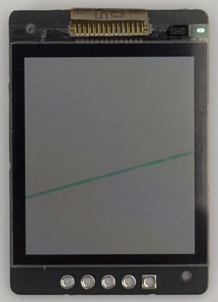

# Introduction

The display module provides an easy way for you to know if your Rolio halves are connected and talking to each other properly as well as your charge state and PC connection status.

Whilst the displays are technically optional I'd not recommend building a Rolio without a display on each half.

# Displays

Three different display modules have been tested with the Rolio46. All of these display modules are based on Sharp's memory display technology so offer excellent power consumption profiles.

| Vista508 | Nice!View  | Vista272 |
| ------------- | ------------- | ------------- |
|  |   |   |

Relevant details for each controller are roughly summarized below.

### Vista508

The Vista508 is a wider version of the Vista272/nice!view, its electrical characteristics are very similar. Use of the Vista508 is the only difference between the Rolio46.1 and the Rolio46.2.

The key details of the Vista508 display are as follows:
 * Display area of 20.88x24.36mm
 * 144x168 pixels
 * Power consumption (Typical - Maximum)
   * Fixed image: 25-125uW (7.5-38uA)
   * Updating image at 1 frame per second (30 fps supported): 35-150uW (10-45uA)
 * [Data sheet for display module](https://www.sharpsecd.com/static/media/Sharp-LCD-Specification-LS013B7DH05-12-17-19.4f9deb60.pdf)

The Rolio46 firmware has full support for the Vista508 as well as some useful Python scripts to help customize peripheral artwork.

### Nice!View

The Nice!View is the most common of the available displays and is available from many distributors. Documentation on the Nice!View can be found on the [Nice Technologies website](https://nicekeyboards.com/docs/nice-view/).

The key details of the Nice!View display are as follows:
 * Display area of 25.28x10.74mm
 * 160x68 pixels
 * Power consumption (Typical - Maximum)
   * Fixed image: 15-50uW (4.5-15uA)
   * Updating image at 1 frame per second (30 fps supported): 25-100uW (7.5-30uA)
 * [Data sheet for display module](https://www.sharpsde.com/fileadmin/products/Displays/Specs/LS011B7DH03_24Nov17_Spec_LD-29Y03.pdf)

### Vista272

The Vista272 is essentially a drop in replacement for the Nice!View display, it uses the exact same display module.

The key details of the Vista272 display are as follows:
 * Display area of 25.28x10.74mm
 * 160x68 pixels
 * Power consumption (Typical - Maximum)
   * Fixed image: 15-50uW (4.5-15uA)
   * Updating image at 1 frame per second (30 fps supported): 25-100uW (7.5-30uA)
 * [Data sheet for display module](https://www.sharpsde.com/fileadmin/products/Displays/Specs/LS011B7DH03_24Nov17_Spec_LD-29Y03.pdf)
